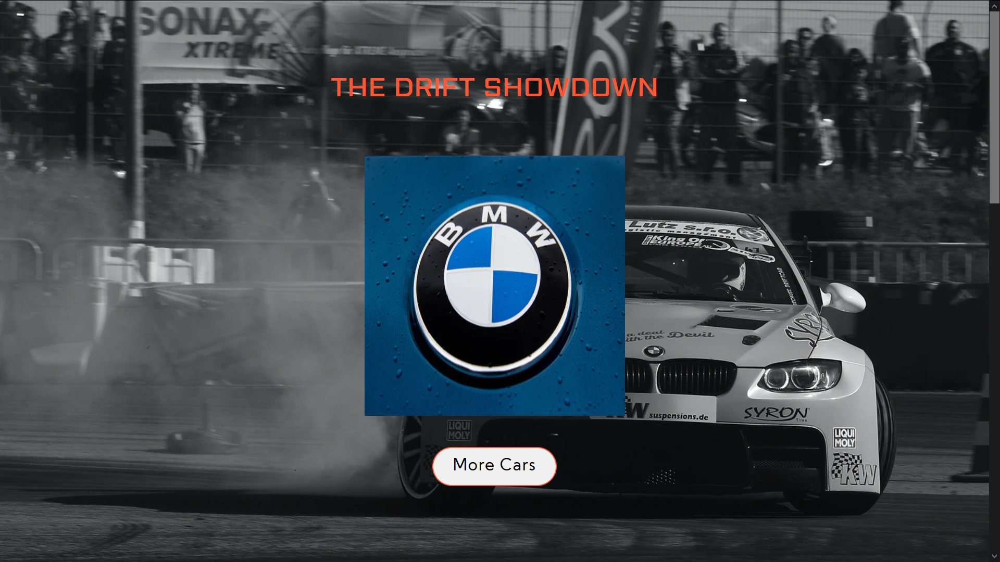

# Basic HTML Website
> This is a Simple Card Slider built using simple HTML and CSS. 

* Please go through the whole Code for better learning as most of the basic concepts are covered. Follow Comments for better understanding.
* The Website is Responsive.
* It is a very basic website built using HTML/ CSS.
* The User/ Editor can try out new colors, padding, margins, images etc.
* The Class Name play a very important role in designing the website, change only for learning purpose.

## HTML/ CSS Topics Covered

The Topics covered in this Website Building are :

1. Basics of HTML Basic/ Introduction.
2. Parallax Effect with HTML
3. HTML Headings
4. HTML Paragraphs
5. HTML Styles
6. Image Slideshow/ Carousel
7. CSS Basics
8. Footer 

Any improvements are always welcomed!

## Setup

Simply fork this and open index.html file to view it in your browser

